# AppCenter

[](https://github.com/wakawakalululu/appcenter/actions/workflows/ci.yml)
[](https://github.com/wakawakalululu/appcenter/releases)
[](LICENSE)

企业「应用中心 / 软件商店」客户端引擎 + 目录服务端。TypeScript 实现，零构建步骤（Node 直接跑 TS）。


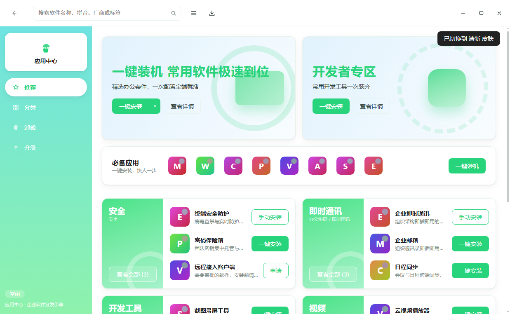

<table>
  <tr>
    <td>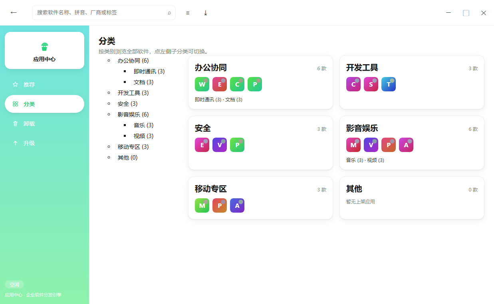</td>
    <td>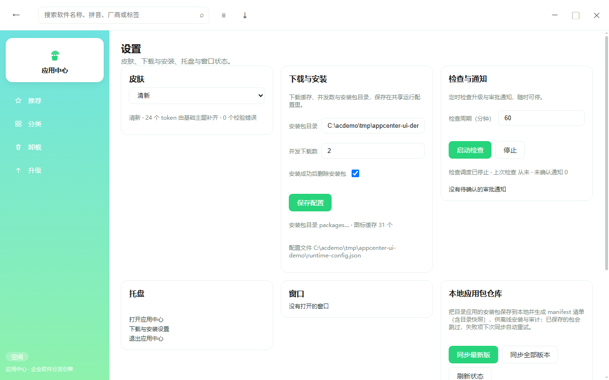</td>
  </tr>
  <tr>
    <td>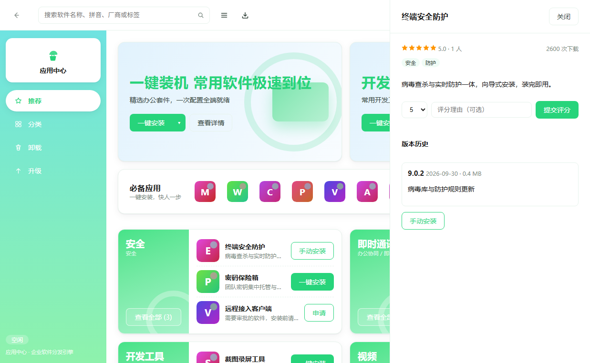</td>
    <td></td>
  </tr>
</table>

覆盖软件分发全链路：目录与分类检索、本机已装清单、卸载残留扫描与清理、断点续传下载与校验、
多类型安装执行计划、批量安装与升级、申请审批、皮肤与主题、客户端自升级、系统托盘与多窗口。

> 本项目为独立实现的开源软件。终端管控类能力（行为采集、Web 中间人、锁屏、远程桌面、
> 驱动级进程拦截、静默保活）不在设计范围内。

## 架构总览

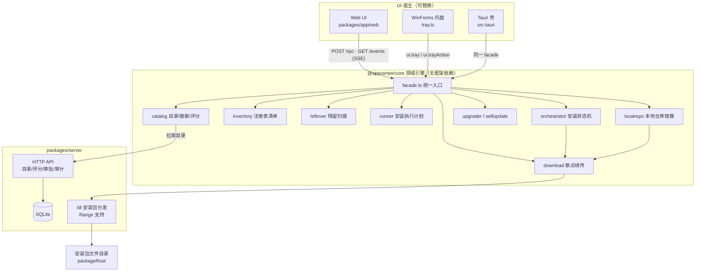

一条安装链路的状态机（UI 通过 SSE 实时收到每次迁移）：

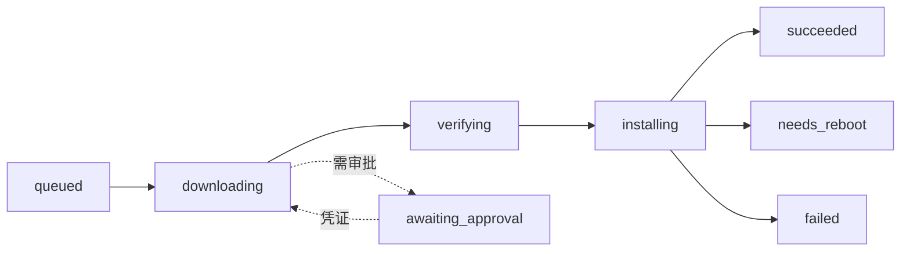

目录 × 本机清单联表后，界面按钮的语义完全由引擎判定（前端不猜状态）：

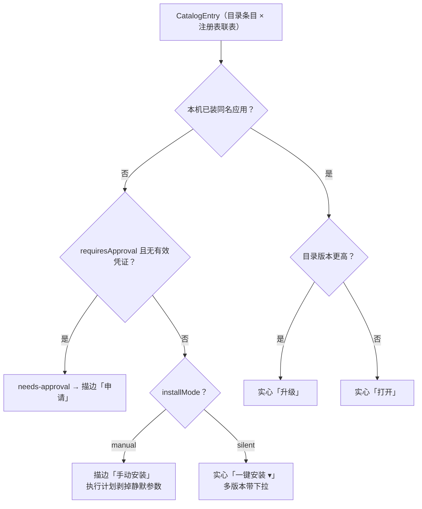

核心引擎的模块依赖（都经 `facade.ts` 单入口暴露，UI/CLI 不直接触达内部）：

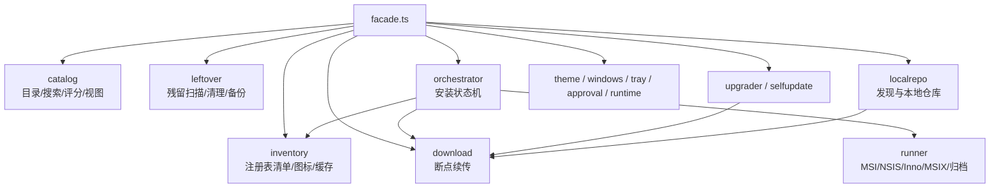

## 目录结构

```
packages/core      领域引擎，无框架依赖，Windows 交互全部走可注入接口
  catalog/         目录、分类树、中文搜索、贝叶斯评分
  inventory/       注册表卸载项清单（HKLM 64/32 + HKCU）、图标缓存、清单落盘缓存
  leftover/        卸载残留扫描与清理计划（只读扫描 + 白名单删除）
  download/        Range 断点续传下载器，sha256 校验后才落地
  runner/          MSI / NSIS / Inno / MSIX / 归档 / 脚本的执行计划
  orchestrator/    安装状态机、批量队列、装后版本回读、卸载后残留扫描
  upgrader/        版本比较与升级计划
  selfupdate/      客户端自升级：暂存、校验、换版、失败回滚
  approval/        申请审批生命周期与安装凭证
  runtime/         跨进程运行配置、开机自启
  theme/           皮肤 token 注册表与校验
  windows/         多窗口与单实例锁
  tray/            托盘状态机与菜单
  localrepo/       真机安装包发现与本地仓库镜像
  facade.ts        面向 UI 宿主的统一入口
packages/server    目录 / 评分 / 审批 / 鉴权 / 审计 / 自升级清单 HTTP 服务 + SQLite + Range 下载
packages/app       本地 Web 客户端（bridge + SSE）、WinForms 托盘宿主、桌面 UI
packages/cli       无头壳：JSON Lines IPC，可对接任意 UI 宿主
```

## 运行

需要 Node >= 24（用 `--experimental-transform-types` 直接跑 TS，无需构建步骤）。

```bash
npm install

# 服务端：建库 + 灌演示数据
node --experimental-transform-types packages/server/src/main.ts --seed

# 客户端壳（另开一个终端）
node --experimental-transform-types packages/cli/src/main.ts search wps
node --experimental-transform-types packages/cli/src/main.ts demo

# 手工喂一条 IPC 指令，协议每行一个 JSON
node --experimental-transform-types packages/cli/src/main.ts shell
{"id":1,"method":"catalog.search","params":{"text":"wps"}}
{"id":2,"method":"upgrade.plan"}
{"id":3,"method":"ui.skin","params":{"id":"cny"}}
{"id":4,"method":"ui.tray"}

# 端到端冒烟：服务端 + CLI + 本机注册表清单
node --experimental-transform-types scripts/smoke.mts

# 校验
npm run typecheck
npm test
```

部署服务端时用 `ADMIN_TOKEN` 保护发布与审批接口，并可按需签发用户/角色令牌：

```bash
ADMIN_TOKEN=xxx DB_FILE=/var/lib/appcenter/catalog.db PACKAGE_ROOT=/srv/packages \
  node --experimental-transform-types packages/server/src/main.ts
```

## 设计要点

1. **引擎与 UI 分离**。`@appcenter/core` 是纯逻辑，不含任何 UI 框架依赖；UI 宿主只需实现
   `WindowHost`（create/show/hide/close/focus）并订阅 `onJob`，即可接 Web、Electron、Tauri 或原生壳。
2. **注册表读写分级**。清单读取走 `reg.exe` 只读查询（`RegClient` 接口，测试注入内存实现）；
   任何写入与删除只发生在显式清理计划里，且必须同时满足：风险被勾选、路径在 `allowWriteRoots` 内、
   确认串正确。`C:\Windows`、盘根、白名单外路径一律拒绝，默认 `dryRun`。
3. **下载即校验**。`AppVersion` 必须带 `sha256` + `sizeBytes`；`.part` + `.part.json` 支撑续传，
   校验不过不进安装态，体积不符保留断点，和校验失败区别处理。
4. **审批是安装前置闸门**。`requiresApproval` 的应用在拿到有效凭证前停在 `awaiting_approval`，
   不会先下载再拦。凭证由服务端签发；客户端默认不内置签发密钥（把密钥打进安装包等于没有校验），
   真实性由签发方保证，本地校验归属、有效期与吊销状态。
5. **装后校验与失败清理**。安装进程退出后回读注册表确认真实已装版本写回任务；无论成功、失败还是
   异常，都按 `installerCleanup` 开关清理已下载的安装包。
6. **首屏不卡**。已装清单落盘缓存（原子写 + TTL），命中即返回；过期走「先 `queryChildren` 发现子键、
   再按 regDir 窄查询」的增量刷新；三个卸载根并行扫描。
7. **鉴权与审计**。服务端以「用户 / 角色令牌」取代单一静态令牌（`users`、`api_tokens` 表），
   管理员操作校验角色，关键动作写入 `audit_log`；目录支持按部门下发可见范围。
8. **皮肤是 token 而不是散落色值**。新增皮肤只需注册一份 token 覆盖表，缺失项回落基础主题并被显式记录，
   未通过 `validateTokens` 的皮肤会被拒绝。
9. **自升级可回滚**。暂存包校验通过后写 pending 标记，换版由独立进程完成；
   启动时若 pending 未 commit，视为新版没起来，自动回滚备份。

## 状态

已完成：目录 / 分类 / 搜索 / 评分 / 清单（含缓存与增量刷新）/ 残留扫描 / 清理计划与备份撤销 /
断点续传下载 / 多类型安装执行计划 / 装后版本回读 / 编排与批量队列 / 升级计划 / 自升级 /
审批与通知回路 / 皮肤 / 窗口 / 托盘 / 开机自启开关 / 真机安装包发现与本地仓库镜像 /
服务端（鉴权、审计、部门目录、捆绑包、运营位、机群资产心跳与离线判定）/ CLI 与桌面 UI，全套自动化测试与类型检查在 CI 上强制（含用例数下限断言，防止测试退化成零用例仍报绿）。

目录应用支持 `installMode: silent | manual`——手动安装弹真实安装向导（执行计划剥掉静默参数）。

发现与镜像用两条脚本即可复现：`npm run discover`（只发现并落 `discover-report.json`）、
`npm run build:real-catalog`（发现 → 替换演示目录 → 镜像到 `local-repo/`）。

未完成（需要真实环境或额外决策）：
- 打包为可双击安装的桌面产物：`packages/app/src-tauri/` 的 Tauri v2 骨架已入库，
  但**尚未在本仓库编译验证**，构建需要 Rust + MSVC + WebView2 工具链（`npm run icons` 后 `npm run tauri build`）
- MSIX / 归档安装的实机端到端验证
- 真实升级链路与真实安装包的端到端演练
- 开机自启与托盘图标在真实桌面会话下的验收

## 本地应用包仓库（离线镜像）

把目录里的安装包**持久化到本地并生成自描述清单**——与安装编排器「下载即用完即删」相对，
这是一份可审计、可离线复用的镜像（详细设计见 [LOCAL-REPO.md](LOCAL-REPO.md)）：

```bash
# CLI：发现目录 → 逐个下载（sha256 校验后落地）→ 写 manifest.json
APPCENTER_API=http://127.0.0.1:7991 node --experimental-transform-types packages/cli/src/main.ts repo-sync
APPCENTER_API=http://127.0.0.1:7991 node --experimental-transform-types packages/cli/src/main.ts repo-status

# 界面：设置 → 本地应用包仓库 → 同步最新版 / 同步全部版本
# RPC：repo.sync {allVersions} / repo.status
```

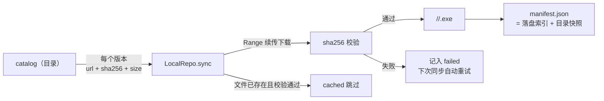

manifest.json 同时携带**目录快照**（全部应用 + 分类），拿到目录即拿到全部语义：

```json
{
  "formatVersion": 1,
  "catalog": { "apps": ["…18 个应用摘要"], "categories": ["…分类树"] },
  "items": [
    { "appId": "wps-office", "version": "12.1.0", "relativePath": "wps-office/12.1.0.msi",
      "sizeBytes": 481280, "sha256": "…", "status": "saved", "attempts": 1 }
  ]
}
```

## 构建流水线

CI（`.github/workflows/ci.yml`）分两个 job，全部跑在 `windows-latest`——注册表清单、
GDI+ 图标提取、WinForms 托盘都是 Windows 专属能力，ubuntu 上跑不全：

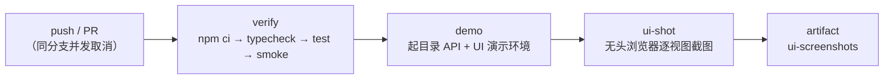

| 阶段 | 命令 | 内容 |
| --- | --- | --- |
| 静态检查 | `npm run typecheck` | `tsc -p tsconfig.json` 全仓严格检查 |
| **Emoji 基线** | `npm run check:emoji` | 基线：全仓文本源零 emoji，Web UI 零字符图形图标（一律内联 SVG），违规即红 |
| 文档引用落地 | `npm run check:links` | 公开文档、Web 根与 wiki 的本地引用必须能在发布出来的树里落地 |
| 依赖许可自审 | `npm run check:licenses` | 直接依赖的 license 必须在宽松白名单内；缺字段或含 copyleft 成分即拒 |
| 覆盖只增不减 | `npm run check:coverage` | 与父提交比较测试文件数，下降即红并点名；拿不到父提交（浅克隆）也算红，不当绿。有意合并/删除请在提交信息里写 coverage-drop 并说明去向 |
| 提交信息禁词 | `npm run check:commits` | 提交信息不是文件，`git grep HEAD` 查不到它；词表与文件级那步同一把尺子（由测试钉住） |
| 单测/集成 | `npm test` | 引擎、服务端、bridge、图标、端到端；CI 另断言「用例数下限」——`node --test` 的 glob 退化到 0 条时仍 exit 0，绿不等于跑过 |
| 冒烟 | `npm run smoke` | 真机注册表清单扫描 + CLI IPC 链路 |
| 演示与截图 | `npm run demo` / `npm run shots` | 本地复现 CI 的截图产物（fresh 皮肤 1237×762） |

整链一条命令：`npm run ci`（上表顺序串起来）。另外 push 前建议跑 `npm run check:delivery`，
它列出「还没进仓库」的文件——CI 只看得到已提交的内容，漏 `git add` 的测试不会让任何人变红。

两个 job 都有 `timeout-minutes` 上限，防止挂起的测试拖穿额度；截图产物随每次 CI 可下载比对（保留 14 天）。

## 文档与站点

- 架构与 API 文档站（GitHub Pages）：<https://wakawakalululu.github.io/appcenter/>
- 使用与协议说明（Wiki）：<https://github.com/wakawakalululu/appcenter/wiki>
- 变更记录：[CHANGELOG.md](CHANGELOG.md)

## 桌面端（packages/app）：从网页到桌面窗口

界面本体是本地 Web 技术（`packages/app/web`，`bridge.ts` 只监听 127.0.0.1，`POST /rpc` 与 CLI 同一
`dispatch` 方法表，`GET /events` 用 SSE 推任务与托盘状态）——但这**不等于它是网页**：
同一份界面按三种形态交付，网页只是其中最内层的渲染层。

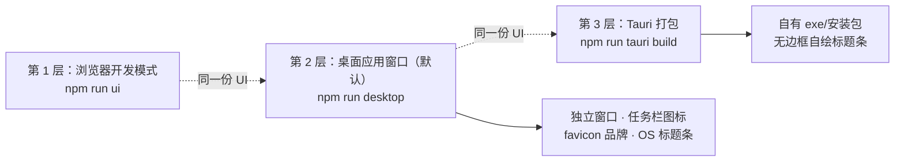

**第 2 层（本轮落地）**：`npm run desktop` 一条命令拉起「目录服务 + 引擎 + 桥」并打开
**独立桌面应用窗口**（Edge/Chrome `--app` 模式）——无标签页、无地址栏、任务栏独立图标、
品牌 favicon 作窗口图标，窗口初始几何取工作区的 60.4% × 66.1%（最小 900×600，居中）。
`?shell=app` 会让界面隐藏自绘的最小化/最大化/关闭按钮（OS 标题条接管，不出现双份控制）。
窗口关闭即整场退出；托盘常驻走 `tray.ts`（见下节）。

```bash
npm run desktop        # 桌面应用窗口 + 引擎（默认 7991 目录端口，UI 端口自动分配）
npm run ui             # 开发模式：纯浏览器标签页
```

**第 3 层（就绪待编译）**：`packages/app/src-tauri/` 是 Tauri v2 骨架，打包出真正自有的
exe/安装包与无边框自绘标题条——需要 Rust + MSVC + WebView2 工具链，本仓库尚未编译验证
（`npm run icons` 后 `npm run tauri build`）。之所以先用 `--app` 窗口过渡：它零工具链依赖
（Edge 恒在）、立即可用，且 UI 代码三层完全同源，切到 Tauri 只是换壳。

界面包含：推荐、分类（含子分类聚合）、搜索、已安装（读本机注册表）、升级与批量升级、
我的申请（提交/取凭证/重试安装）、卸载与残留清理（分段耗时、风险勾选、计划与试运行、CONFIRM 确认串）、
客户端更新、皮肤切换、开机自启、窗口与托盘面板。

## 系统托盘与窗口宿主

不依赖 Electron/Tauri，直接用 Windows 自带的 WinForms 起真实托盘与窗口；
菜单项与状态来自引擎（`ui.tray`），点击菜单把动作回传给 `ui.trayAction`：

```bash
# 先起目录服务 + UI 桥（演示数据）
CATALOG_PORT=8005 UI_PORT=8094 node --experimental-transform-types scripts/ui-demo.mts
# 另开终端：常驻托盘用 TRAY_SECONDS=0，自检用比如 4 秒
UI_PORT=8094 TRAY_SECONDS=4 node --experimental-transform-types packages/app/src/tray.ts
```

开机自启是设置项里用户可见、可关闭的开关（写入 `HKCU\...\CurrentVersion\Run`），不做静默保活。

## 清理备份与撤销

注册表类清理在执行前会导出所属键的 `.reg` 并写 `backup-manifest.json`；没有备份目录会被直接拦截，
导出失败的那一项不会被删除。撤销：

```bash
# 界面里有「从备份撤销」按钮；也可走 RPC
curl -s -X POST http://127.0.0.1:8080/rpc -H "content-type: application/json" \
  -d '{"method":"cleanup.restore","params":{"backupDir":"<上一步返回的目录>"}}'

# 真机自检：自建 HKCU 测试键 → 扫描 → 备份 → 删除 → 还原 → 清理，全程自动
node --experimental-transform-types scripts/verify-cleanup.mts
```

## 设计对标

界面与工程文档不是闭门造车，参照了这些专业项目的公开做法（只借鉴结构与交互模式，不复制素材）：

| 对标 | 借鉴点 | 落在哪 |
| --- | --- | --- |
| **VS Code** 的 README/文档结构 | 徽章 → 一句话定位 → 截图 → 架构图 → 快速开始 → 设计原则的叙述顺序 | 本 README 章节编排 |
| **Microsoft Store / 应用商店类客户端** | 首页三层结构（运营位 → 必备应用 → 分类聚合卡）、按钮三态语义（打开/一键安装/手动安装） | 首页布局与交互模式 |
| **Ant Design** 的 token 化设计 | 皮肤=token 覆盖表、间距/圆角/字号全部走 CSS 变量，缺省回落并被显式记录 | `theme/skin.ts`、`app.css` |
| **Tauri** 的轻量分发思路 | 不内置 Electron，Web UI 可被 WebView/Tauri/WinForms 任一宿主包裹 | `packages/app` 与 src-tauri 骨架 |
| **Homebrew / winget** 的清单思想 | 安装包 + sha256 + 元数据的自描述 manifest，离线可审计 | `localrepo/`、[LOCAL-REPO.md](LOCAL-REPO.md) |

## 兼容性

- **运行时**：Node.js ≥ 24（`--experimental-transform-types` 直接跑 TS，仓库里没有构建产物）。
- **完整功能面需要 Windows**：本机已装清单与残留扫描走 `reg.exe` 与注册表根、托盘与窗口宿主走 PowerShell、
  卸载/安装提权走 UAC。这些在 `packages/core/src/inventory`、`leftover`、`packages/app` 内。
- **其余平台可用**：目录服务端、检索与评分、下载与校验、安装计划生成、审批与凭证、皮肤 token、RPC 协议与 CLI
  都是平台无关的纯 TypeScript；测试套件里依赖 Windows 的用例自带平台跳过，Linux 作业（`verify-linux`）跑同一套断言。
- 界面基于公开的 Web 标准实现，不依赖任何专有控件；图标一律内联 SVG。

## 贡献与安全

- 贡献流程、提交前自查（emoji 基线、公开面引用完整性、用例数下限）见 [CONTRIBUTING.md](CONTRIBUTING.md)。
- 漏洞报告方式与处理时限见 [SECURITY.md](SECURITY.md)。本地 RPC 桥只绑回环、管理端点 fail-closed，
  这两条都有回归用例钉住，改动把它们放开会让测试变红。

## 许可

[MIT](LICENSE)
